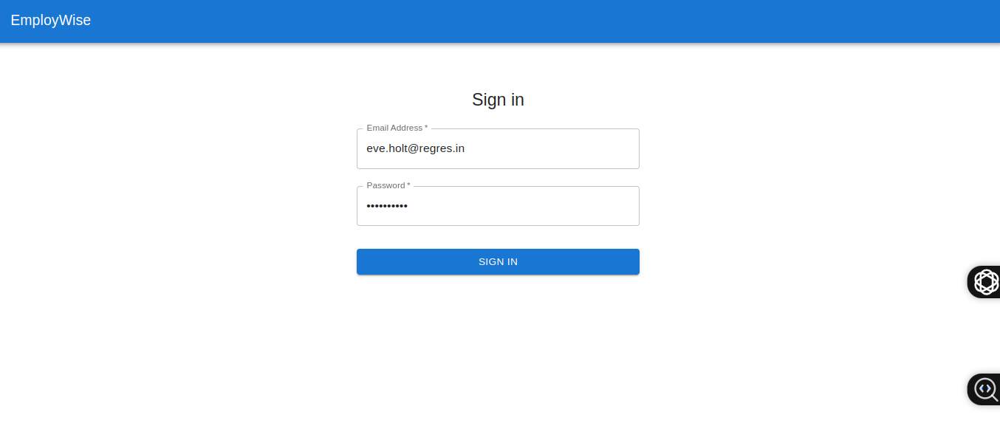

# EmployWise User Management App

A responsive React+Vite application for user management with authentication, built with Material-UI and integrated with the ReqRes API.

## Features

- 🔒 **Authentication System**
  - Login/logout functionality
  - Token-based authentication
  - Protected routes

- 👥 **User Management**
  - Paginated user listing
  - Edit user profiles
  - Delete users
  - Client-side search and filtering

- 🎨 **UI/UX**
  - Responsive design (mobile & desktop)
  - Loading states
  - Error handling
  - Success/error notifications

## Demo

[Live Demo](https://employwise-user-management-rho.vercel.app/)

## Screenshot



## Installation

1. Clone the repository:- Framer Motion  


```bash
git clone https://github.com/richmond-andoh/employwise_user_management.git

cd employwise-user-management

```

Install dependencies:
```bash
npm install

```

Start the development server:

```bash
npm run dev

```
The application will open in your browser at http://localhost:5173

# Usage

## Login Credentials  

Use these credentials to log in:  

- **Email**: `eve.holt@reqres.in`  
- **Password**: `cityslicka`  

## API Endpoints Used  

| Feature      | Endpoint                      | Method |
|-------------|--------------------------------|--------|
| Login       | `/api/login`                   | POST   |
| List Users  | `/api/users?page={page}`       | GET    |
| Update User | `/api/users/{id}`              | PUT    |
| Delete User | `/api/users/{id}`              | DELETE |

## Project Structure  
src/
├── components/
│   ├── Auth/
│   │   └── Login.jsx
│   ├── Users/
│   │   ├── UserList.jsx
│   │   ├── UserCard.jsx
│   │   └── EditUser.jsx
│   └── Layout/
│       └── Navbar.jsx
├── context/
│   └── AuthContext.js
├── services/
│   └── api.js
├── App.js
└── index.js


## Technologies Used  
- React + Vite
- Material UI  
- Axios  
- React Router  
